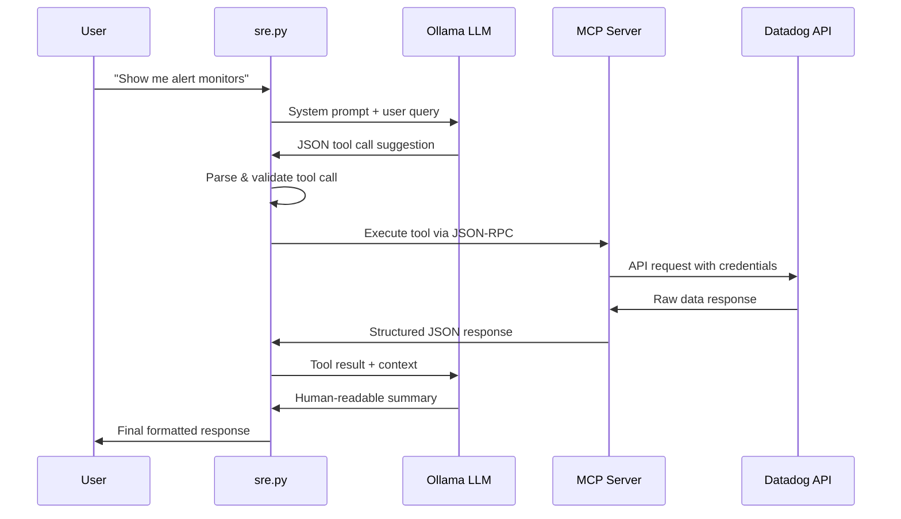
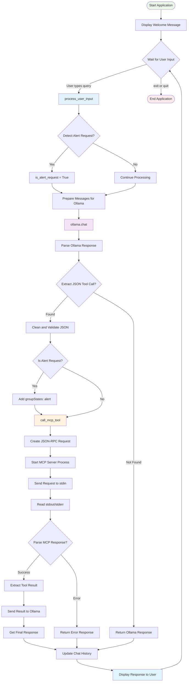

# Datadog SRE Assistant - sre.py

A conversational AI assistant that provides natural language interface to Datadog monitoring tools using Ollama and MCP (Model Context Protocol).

## 🏗️ Architecture Overview

The system consists of three main components working together to provide a seamless conversational experience for Datadog operations:

## 📊 Data Flow Diagram

The following diagram shows how user queries are processed through the system:



## 🧩 Core Components

### 1. **sre.py - Main Orchestrator**
- **Purpose**: Central coordination hub that manages the conversation flow
- **Key Functions**:
  - Natural language processing via Ollama integration
  - Tool call detection and validation
  - MCP server communication
  - Chat history management
  - Response formatting

### 2. **Ollama LLM (mistral:latest)**
- **Purpose**: Natural language understanding and generation
- **Capabilities**:
  - Interprets user queries in natural language
  - Generates appropriate JSON tool calls
  - Provides human-readable summaries of technical data
  - Maintains conversation context

### 3. **MCP Server (mcp-server-datadog)**
- **Purpose**: Secure bridge between the assistant and Datadog APIs
- **Features**:
  - Handles authentication with Datadog
  - Provides standardized tool interface
  - Data validation and error handling
  - Rate limiting and API management

## 🛠️ Available Tools

| Tool | Description | Parameters |
|------|-------------|------------|
| `get_monitors` | Fetch monitor status and details | `groupStates`, `name`, `tags` |
| `list_incidents` | Retrieve incident information | `filter`, `pagination` |
| `list_dashboards` | Get dashboard listings | `tags` |

## 🚀 Usage Examples

### Basic Monitor Queries
```
> Show me all alert monitors
> Get monitors for service web-backend
> List monitors in warning state
```

### Incident Management
```
> Show recent incidents
> List high priority incidents
> Get incidents from last 24 hours
```

### Dashboard Operations
```
> List all dashboards
> Show dashboards tagged with 'production'
```

## 📋 Prerequisites

### Required Software
- **Node.js** (for MCP server)
- **Python 3.8+** with dependencies:
  - `ollama`
  - `python-dotenv`
  - `subprocess`
- **Ollama** with `mistral:latest` model

### Environment Setup
Create a `.env` file with your Datadog credentials:
```env
DATADOG_API_KEY=your_api_key_here
DATADOG_APP_KEY=your_app_key_here
```

### MCP Server Setup
Ensure the MCP Datadog server is built and ready:
```bash
cd mcp-server-datadog
npm install
npm run build
```

## 🔧 Configuration

### Key Configuration Variables
```python
MCP_SERVER_COMMAND = ['node', 'mcp-server-datadog/build/index.js']
OLLAMA_MODEL = 'mistral:latest'
```

### System Prompt
The assistant uses a comprehensive system prompt that:
- Defines available tools and their parameters
- Sets JSON formatting rules
- Provides special handling for alert monitors
- Ensures proper response formatting

## 💡 How It Works

### Internal Workflow Diagram

The following flowchart shows the detailed internal processing flow of sre.py:



### 1. **User Input Processing**
- User enters natural language query
- System detects if query relates to alerts specifically
- Query is sent to Ollama with system context

### 2. **LLM Tool Call Generation**
- Ollama analyzes the query against available tools
- Generates appropriate JSON tool call
- Response is validated and cleaned

### 3. **MCP Tool Execution**
- Tool call is formatted as JSON-RPC request
- MCP server processes the request
- Datadog API is called with proper authentication
- Results are returned in structured format

### 4. **Response Generation**
- Raw Datadog data is sent back to Ollama
- LLM generates human-readable summary
- Final response is presented to user

## 🎯 Key Features

### **Smart Alert Detection**
- Automatically detects when users ask for alert-related information
- Properly sets `groupStates: ["alert"]` parameter
- Filters results to show only relevant alerts

### **Conversation History**
- Maintains context throughout the session
- Allows follow-up questions and refinements
- Preserves tool call results for reference

### **Error Handling**
- Comprehensive error checking at each step
- Graceful degradation when tools fail
- Clear error messages for debugging

### **JSON Parsing Intelligence**
- Handles various JSON response formats from Datadog
- Extracts data from mixed text/JSON responses
- Falls back to raw text when JSON parsing fails

## 🚨 Common Use Cases

### **SRE Daily Operations**
- Quick monitor status checks
- Incident investigation and tracking
- Dashboard review and monitoring
- Alert triage and analysis

### **Troubleshooting Workflows**
- "Show me all alerts for service X"
- "What incidents happened today?"
- "Check monitor status for critical services"

## 🔍 Technical Details

### **JSON-RPC Communication**
The system uses JSON-RPC 2.0 protocol for MCP communication:
```json
{
  "id": "req-1234567890",
  "jsonrpc": "2.0", 
  "method": "tools/call",
  "params": {
    "name": "get_monitors",
    "arguments": {
      "groupStates": ["alert"]
    }
  }
}
```

### **Response Processing**
Responses go through multiple parsing stages:
1. Raw subprocess output capture
2. JSON-RPC response extraction
3. Content text parsing
4. JSON data extraction
5. LLM summarization

## 🛡️ Security Considerations

- Environment variables for API credentials
- No hardcoded secrets in code
- MCP server handles all external API communication
- Subprocess isolation for tool execution

## 🧪 Testing and Development

To test the assistant:
1. Ensure all prerequisites are installed
2. Set up environment variables
3. Build the MCP server
4. Run: `python sre.py`
5. Try example queries listed above

## 📈 Future Enhancements

- Additional Datadog tools (synthetics, logs, metrics)
- Multi-tenant support
- Custom alerting rules
- Integration with other monitoring platforms
- Web interface for easier access